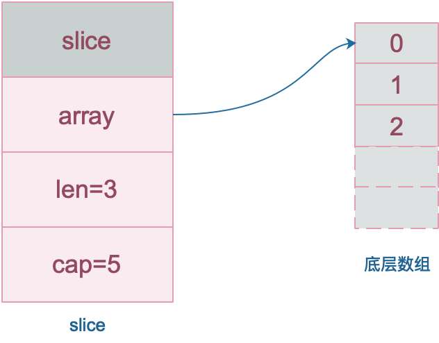
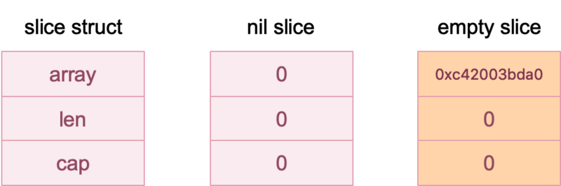

# 4.2 slice

切片底层实现是struct，包含一个指向底层数据的指针、切片当前长度和切片容量，其工作机制类似数组指针的一种包装

源码：/src/runtime/slice.go
```
type slice struct {
	array unsafe.Pointer
	len   int
	cap   int
}
```
一个指向真实 array 地址的指针 ptr ，slice 的长度 len 和容量 cap 。
slice实质就是一个包含3个属性的struct：
- 指针，指向底层数组；
- len slice 的长度 len；
- 容量，底层数组的元素个数，容量 >= 长度。在底层数组不进行扩容的情况下，容量也是 slice 可以扩张的最大限度。

**需要注意的是**
- 使用下标对slice的元素进行访问时，下标不能超过slice的长度len
- 容量cap >= 长度len，当向一个切片append一个新元素，若append之前已经cap == len，此时会新创建一个底层数组作为append的返回值（详细看）
- 多个slice可以指向同一个数组，对于这些slice的元素操作会互相影响




## 4.2.1 声明和创建slice

|序号 |方式 |代码示例
|:---| :---| :---|
|1	 |直接声明|var slice []int
|2	|new	|slice := *new([]int)
|3	|make	|slice := make([]int, 5, 10)
|4	|字面量	|slice := []int{1,2,3,4,5}
|5	|从切片或数组“截取”	|slice := array[1:5] 或 slice := sourceSlice[1:5]


(1) 直接声明
直接声明一个slice，是nil slice，即slice的struct中三个字段均为零值；而容易与此混淆的是empty slice

二者区别在于
- nil slice是由直接声明产生的，没有初始化过；
- empty slice是进行了初始化语句（len=cap=0）产生的，Go语言会把没有进行内存分配的指针设置为一个默认值（全局变量zerobase的值，/src/runtime/malloc.go line745），即empty slice array字段不为零值，只有len和cap为零



图中0xc42003bda0仅做示例，实际上应为运行时全局变量zerobase的值


|创建方式|nil slice	| empty slice |
|:--- | :---| :---|
|方式一|	var s1 []int	|var s2 = []int{}|
|方式二|	var s4 = *new([]int)	|var s3 = make([]int, 0)|
|长度	|0|	0|
|容量	|0|	0|
|和 nil 比较|true|false

(2) new

由于slice本质是一个stuct，new调用后返回产生的struct的地址，之后再取地址得到struct本身，即切片

```
slice := *new([]int)  
```


(3) make

make是slice、map和channel专用的初始化函数，实际上是一个语法糖，编译后会替换为对应类型的make方法。对于slice来说，编译后会替换为runtime.makeslice


详细可参考https://segmentfault.com/a/1190000019378931 深度解密Go语言之Slice

// src/runtime/slice.go
```
func makeslice(et *_type, len, cap int) unsafe.Pointer {
	mem, overflow := math.MulUintptr(et.size, uintptr(cap))
	if overflow || mem > maxAlloc || len < 0 || len > cap {
		// NOTE: Produce a 'len out of range' error instead of a
		// 'cap out of range' error when someone does make([]T, bignumber).
		// 'cap out of range' is true too, but since the cap is only being
		// supplied implicitly, saying len is clearer.
		// See golang.org/issue/4085.
		mem, overflow := math.MulUintptr(et.size, uintptr(len))
		if overflow || mem > maxAlloc || len < 0 {
			panicmakeslicelen()
		}
		panicmakeslicecap()
	}

	return mallocgc(mem, et, true) // 调用内存分配函数
}
```

```
// src/runtime/malloc.go
// base address for all 0-byte allocations
var zerobase uintptr

func mallocgc(size uintptr, typ *_type, needzero bool) unsafe.Pointer {
	if gcphase == _GCmarktermination {
		throw("mallocgc called with gcphase == _GCmarktermination")
	}

	if size == 0 {
		return unsafe.Pointer(&zerobase)  // 需要分配的内存为0，则直接返回zerobase的unsafe.Pointer
	}

	if debug.sbrk != 0 {
		align := uintptr(16)
		if typ != nil {
			align = uintptr(typ.align)
		}
		return persistentalloc(size, align, &memstats.other_sys)
	}
	..... // 省略
}
```

(4) 字面量

```
package main

import "fmt"

func main() {
    s1 := []int{0, 1, 2, 3, 8: 100}  // 等价于先初始化一个array然后，s1 := array[:]
    fmt.Println(s1, len(s1), cap(s1))
}
//Output
[0 1 2 3 0 0 0 0 100] 9 9
```

(5) 从数组或其他切片截取

```
slice := array[low:high:max]   

slice := otherslice[low:high:max]

切片 := 数组或其他切片[起始下标:终止下标:截取到原数组或切片的最大位置]

low省略默认为0，high省略默认为原数组或切片的len，max省略默认为原数组或切片的cap

需要满足 0 <= 起始下标 <= 终止下标 <= 截取到原数组或切片的位置最大位置 <= 原数组或切片cap，否则编译错误

第三个参数含义有点绕，实际上就是为了指定新slice的cap， 新slice的cap = 截取到原数组或切片的位置最大位置 - 起始下标， 若不指定该参数默认该值为原数组或切片的cap
```


```
package main

import "fmt"

func main() {
	slice := make([]int, 0, 15)
	for i := 0; i < 10; i++ {
		slice = append(slice, i)
	}
	//s1与s2等价
	s1 := slice[2:5]
	s2 := slice[2:5:cap(slice)]

	// 对于切片来说s3与s4等价
	s3 := slice[:] 
	s4 := slice // 若slice是数组，就必须slice[:]

	// low:high:max  low省略默认为0，high省略默认为len，max省略默认为cap
	s5 := slice[:5]
	s6 := slice[5:]
	s7 := slice[2:6]
	s8 := slice[2:6:6]
	s9 := slice[2:6:8]

	fmt.Printf("slice %v len=%d cap=%d\n", slice, len(slice), cap(slice))
	fmt.Printf("s1 %v len=%d cap=%d\n", s1, len(s1), cap(s1))
	fmt.Printf("s2 %v len=%d cap=%d\n", s2, len(s2), cap(s2))
	fmt.Printf("s3 %v len=%d cap=%d\n", s3, len(s3), cap(s3))
	fmt.Printf("s4 %v len=%d cap=%d\n", s4, len(s4), cap(s4))
	fmt.Printf("s5 %v len=%d cap=%d\n", s5, len(s5), cap(s5))
	fmt.Printf("s6 %v len=%d cap=%d\n", s6, len(s6), cap(s6))
	fmt.Printf("s7 %v len=%d cap=%d\n", s7, len(s7), cap(s4))
	fmt.Printf("s8 %v len=%d cap=%d\n", s8, len(s8), cap(s8))
	fmt.Printf("s9 %v len=%d cap=%d\n", s9, len(s9), cap(s9))
}
//Output
slice [0 1 2 3 4 5 6 7 8 9] len=10 cap=15
s1 [2 3 4] len=3 cap=13
s2 [2 3 4] len=3 cap=13
s3 [0 1 2 3 4 5 6 7 8 9] len=10 cap=15
s4 [0 1 2 3 4 5 6 7 8 9] len=10 cap=15
s5 [0 1 2 3 4] len=5 cap=15
s6 [5 6 7 8 9] len=5 cap=10
s7 [2 3 4 5] len=4 cap=15
s8 [2 3 4 5] len=4 cap=4
s9 [2 3 4 5] len=4 cap=6

```

## 4.2.2 append
append是slice专用内置函数，用于向slice中添加新元素

```
func append(slice []Type, elems ...Type) []Type
```

用法

```
slice = append(slice, elem1, elem2)
slice = append(slice, otherSlice...)
```

执行append n个元素的逻辑：
（1）获取传入struct的array，len，cap三个字段
（2）判断添加n个元素是否会超过最大容量（len+n> cap），若超过，则扩容底层数组，设置cap等于新的底层数组容量
（3）将底层数组下标（len到len + n - 1）设置为添加的元素值，设置len += n
（4）返回包含修改后array，len或cap三个字段的struct

需要注意的是：
slice实质是一个struct，append传入的是struct的值而非指针，所以在append函数内是无法改变外部slice的array，len和cap。append函数的使用必须接收返回值进行赋值，即slice = append(slice, elem1, elem2)

```
package main

import "fmt"

func main() {
	array := [10]int{}
	slice := array[0:0]
	_ = append(slice, 1) // 这样等价于仅把底层数组 array[len(slice)]= 1
	fmt.Printf("array:%v\n", array)
	fmt.Printf("slice:%v len=%d cap=%d\n", slice, len(slice), cap(slice))

	_ = append(slice, 2)
	fmt.Printf("array:%v\n", array) // 这样等价于仅把底层数组 array[len(slice)]= 2
	fmt.Printf("slice:%v len=%d cap=%d\n", slice, len(slice), cap(slice))

	slice = append(slice, 3) // 把底层数组 array[len(slice)]= 3，并且通过返回值重新赋值更新了slice的len
	fmt.Printf("array:%v\n", array)
	fmt.Printf("slice:%v len=%d cap=%d\n", slice, len(slice), cap(slice))

	slice = append(slice, 4) // // 把底层数组 array[len(slice)]= 4，并且通过返回值重新赋值更新了slice的len
	fmt.Printf("array:%v\n", array)
	fmt.Printf("slice:%v len=%d cap=%d\n", slice, len(slice), cap(slice))
}
//Output
array:[1 0 0 0 0 0 0 0 0 0]
slice:[] len=0 cap=10
array:[2 0 0 0 0 0 0 0 0 0]
slice:[] len=0 cap=10
array:[3 0 0 0 0 0 0 0 0 0]
slice:[3] len=1 cap=10
array:[3 4 0 0 0 0 0 0 0 0]
slice:[3 4] len=2 cap=10
```


## 4.2.3 切片底层数组扩容规则

对于源码src/runtime/slice.go中growslice函数的理解

切片cap为n，扩容逻辑为
（1）n小于1024，扩容为内存对齐2n
（2）n>=1024，扩容为内存对齐1.25n


注意：

这里内存对齐会导致实际上内存分配大于等于2n或1.25n，只在n满足某些条件下，才恰好n小于1024扩容为2n，n大于等于1024扩容为1.25n


## 使用unsafe.Pointer查看slice底层数值变化逻辑

http://www.opscoder.info/golang_unsafe.html

```
package main
 
import (
    "fmt"
    "unsafe"
)
 
type Slice struct {
    ptr unsafe.Pointer // Array pointer
    len int            // slice length
    cap int            // slice capacity
}
 
// 因为需要指针计算，所以需要获取int的长度
// 32位 int length = 4
// 64位 int length = 8
var intLen = int(unsafe.Sizeof(int(0)))
 
func main() {
    s := make([]int, 10, 20)
 
    // 利用指针读取 slice memory 的数据
    if intLen == 4 { // 32位
        m := *(*[4 + 4*2]byte)(unsafe.Pointer(&s))
        fmt.Println("slice memory:", m)
    } else { // 64 位
        m := *(*[8 + 8*2]byte)(unsafe.Pointer(&s))
        fmt.Println("slice memory:", m)
    }
 
    // 把slice转换成自定义的 Slice struct
    slice := (*Slice)(unsafe.Pointer(&s))
    fmt.Println("slice struct:", slice)
    fmt.Printf("ptr:%v len:%v cap:%v \n", slice.ptr, slice.len, slice.cap)
    fmt.Printf("golang slice len:%v cap:%v \n", len(s), cap(s))
 
    s[0] = 0
    s[1] = 1
    s[2] = 2
 
    // 转成数组输出
    arr := *(*[3]int)(unsafe.Pointer(slice.ptr))
    fmt.Println("array values:", arr)
 
    // 修改 slice 的 len
    slice.len = 15
    fmt.Println("Slice len: ", slice.len)
    fmt.Println("golang slice len: ", len(s))
}
// Output
slice memory: [0 64 6 32 200 0 0 0 10 0 0 0 0 0 0 0 20 0 0 0 0 0 0 0]
slice struct: &{0xc820064000 10 20}
ptr:0xc820064000 len:10 cap:20
golang slice len:10 cap:20
array values: [0 1 2]
Slice len:  15
golang slice len:  15
```


## 4.2.4 是否可比较
不可比较
- slice只能与nil比较，判断是是否为nil slice
- slice之间不可比较
- 比较slice会导致编译错误
- 比较interface{}引用的slice，会导致运行时panic

## 4.2.5 参考资料
https://blog.csdn.net/m0_37579159/article/details/79344056
https://segmentfault.com/a/1190000019375454
https://blog.csdn.net/m0_37579159/article/details/79344056 golang-slice底层分析
https://segmentfault.com/a/1190000019389665 深入Go的底层，带你走近一群有追求的人
https://segmentfault.com/a/1190000019378931 深度解密Go语言之Slice
https://halfrost.com/go_slice/ 深入解析 Go 中 Slice 底层实现
https://blog.csdn.net/wangkai_123456/article/details/69676743 golang slice 切片原理
https://jodezer.github.io/2017/05/golangSlice%E7%9A%84%E6%89%A9%E5%AE%B9%E8%A7%84%E5%88%99 golangSlice的扩容规则
