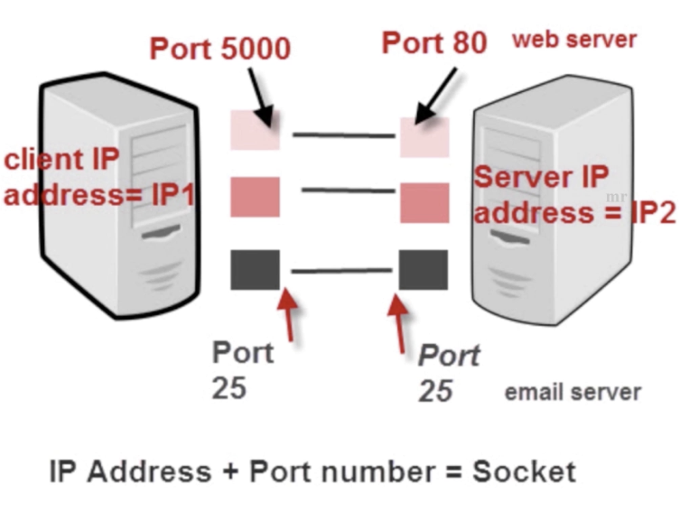

# socket

## what is socket

 - ip地址与port端口结合的协议（RFC 793）
 - 一种地址与端口结合描述的协议
 - TCP/IP协议的相关API的总称，网络API集合的实现
 - 涵盖了：Stream Socket/Datagram Socket

## Socket的作用和组成
一般含义（通常是编程语言中支持的）：
 - 在网络传输中用于标示两个端点之间的链接（端点 = ip + port）
 - 四个要素：客户端地址、端口，服务器地址、端口

广义来说（操作系统提供的系统调用接口socket）：
- socket是获取网卡数据的一个操作系统接口
- 通过socket系统调用可以从网卡获取链路层、网络层、传输层和应用层数据
- 不仅限于传输层，更不仅限于传输层的tcp、udp（前提是操作系统允许，linux是允许，macOS和windows出于安全考虑部分可能不支持）

 

## Socket之TCP
 - TCP是面向连接的通信的通信协议
 - 通过三次握手建立连接，通讯完成四次挥手断开连接
 - 由于TCP是面向连接的，所以只能用于端到端的通讯
 
## Socket之UDP
 - UDP是面向无连接的通讯协议
 - UDP数据包括目的端口号和源端口号信息
 
## 那什么是面向连接？什么是无连接？
首先这个概念通常是tcp是面向连接的，udp是无连接的

那么这个概念是发生在传输层，与网络层的ip协议无关

连接是通信双方经过一系列数据传输达成的一种状态，即确认网络通畅、双方准备好发送接收数据等，就比如二人在路上相遇、然后互相挥手打招呼，那么此时就是建立了连接（双方知道对方存在，且可以发送（挥手动作）、接收（对方挥手动作）信息），

无连接则是通信双方不确认对方状态，直接发送数据，就比如一个人走在路上，然后说xxx，你如何如何，实际xxx并不一定在这里、更不一定能接收到这条信息

参考示例代码：
https://github.com/mushroomsir/blog/blob/master/Go中原始套接字的深度实践.md
https://github.com/mushroomsir/blog/blob/master/Go中链路层套接字的实践.md
